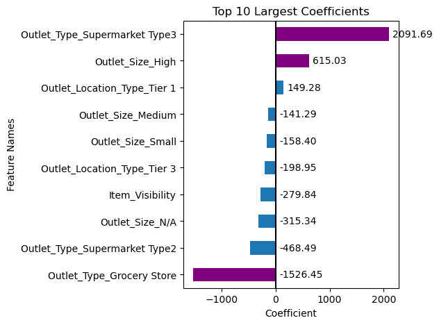
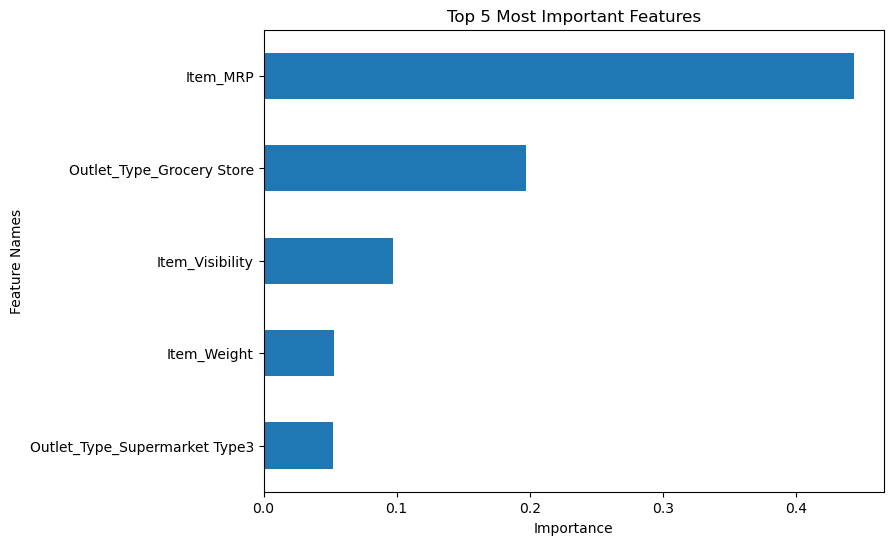
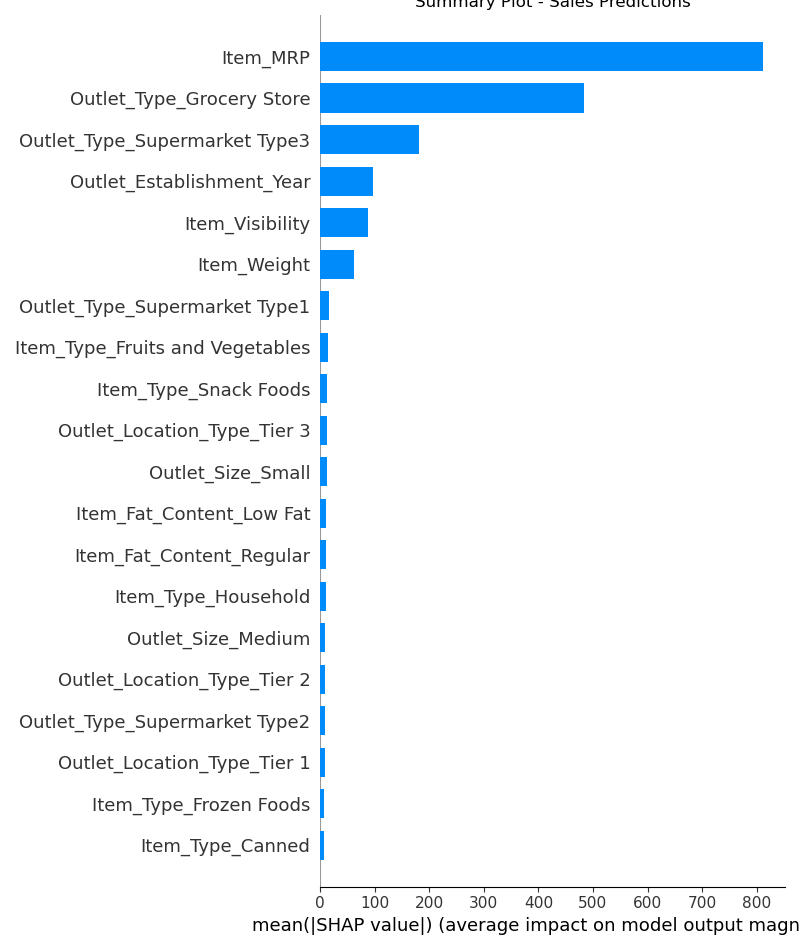
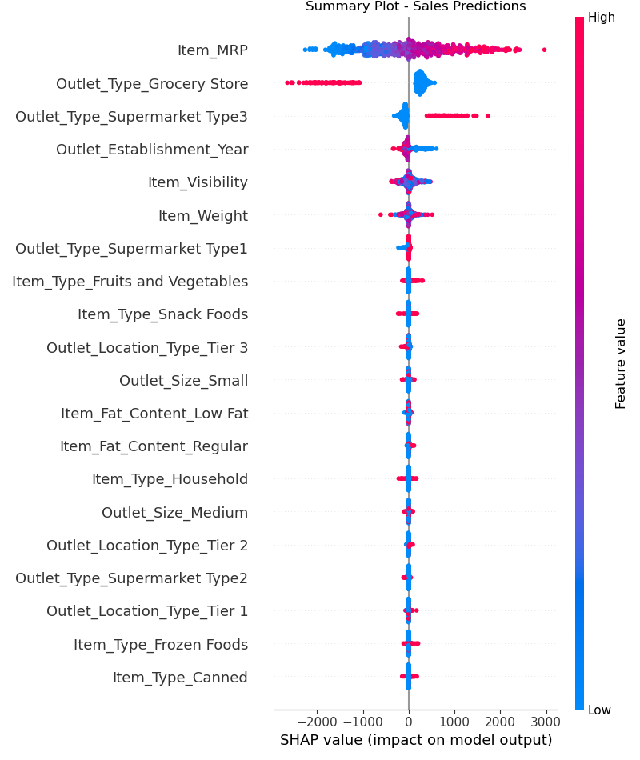
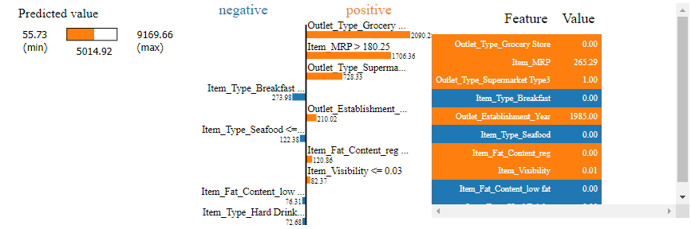
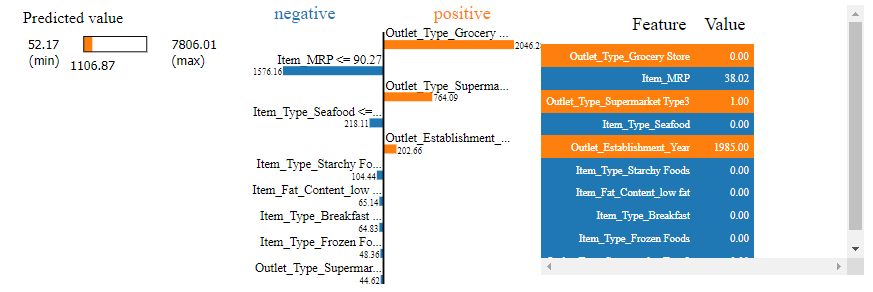
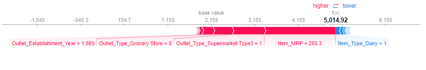
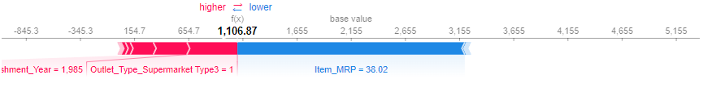

# Prediction of Product Sales: Research & Recommendations

## Performing Data Analysis on Product Sales
##### Jalicia Harris

#### Researched product data to make predictions and recommenddations to improve future profits

## Data Source:

Big Mart Sales Prediction /content/drive/MyDrive/Data/sales_predictions_2023.csv

Original Source: https://www.kaggle.com/datasets/shivan118/big-mart-sales-prediction-datasets

- This dataset contained 8523 rows and 12 columns.
## Data Dictionary:

- Variable Name: Description
- Item_Identifier:	Unique product ID
- Item_Weight:	Weight of product
- Item_Fat_Content: Whether the product is low fat or regular
- Item_Visibility:	The percentage of total display area of all products in a store allocated to the particular product
- Item_Type:	The category to which the product belongs
- Item_MR:	Maximum Retail Price (list price) of the product
- Outlet_Identifier:	Unique store ID
- Outlet_Establishment_Year:	The year in which store was established
- Outlet_Size:	The size of the store in terms of ground area covered
- Outlet_Location_Type:	The type of area in which the store is located
- Outlet_Type:	Whether the outlet is a grocery store or some sort of supermarket
- Item_Outlet_Sales:	Sales of the product in the particular store. This is the target variable to be predicted.

## Cleaning Methods for Dataset:

- The dataset was checked for duplicates.
 - There were 0 found.
- Missing values were found in the 'Item_Weight' column.
 - The values were replaced with the calculated mean.
- Missing values were also found in the 'Outlet_Size' column.
 - The values were filled in with "Unknown" as there was no way of knowing the outlet sizes.
- Inconsistent values were found in the 'Item_Fat_Content' column.
 - The values were corrected by replacing the odd values.

## Exploratory Data Analysis

- The heatmap above shows that the highest negative correlation are between 'Item Outlet Sales' and 'Item Visibility'.
- The highest positve correlation are between 'Item MRP' and 'Item Outlet Sales.

## Explanatory Data Analysis

- The bar graph shows that Supermarket Type 3 has the highest amount of sales.
- Grocery stores seem to bring in the least amounts profits.

## Machine Learning Using the Following Models:

- Linear Regression Model
- Default Decision Tree Regressor Model
- Tuned Decision Regressor Model
- Default Random Forest Regressor Model
- Tuned Random Forest Regressor Model

### Linear Regression Model:
- Results for training data:
  - R^2 = 1.0
  - MSE = 0.0
  - RMSE = 0.0

- Results for testing data:
  - R^2 = 0.193
  - MSE = 2226281.801
  - RMSE = 1492.073

### Default Decision Tree Regressor Model:

- Results for training data:
  - R^2 = 1.0
  - MSE = 0.0
  - RMSE = 0.0

- Results for testing data:
  - R^2 = 0.193
  - MSE = 2226281.801
  - RMSE = 1492.073

### Tuned Decision Tree Regressor Model:

- Results for training data:
  - R^2 = 0.938
  - MSE = 183589.453
  - RMSE = 428.473

- Results for testing data:
  - R^2 = 0.558
  - MSE = 1218472.771
  - RMSE = 1103.845

### Default Random Forest Regressor Model:

- Results for training data:
  - R^2 = 0.938
  - MSE = 183589.453
  - RMSE = 428.473

- Results for testing data:
  - R^2 = 0.558
  - MSE = 1218472.771
  - RMSE = 1103.845

### Tuned Random Forest Regressor Model:

- Results for training data:
  - R^2 = 0.94
  - MSE = 177240.814
  - RMSE = 421.0

- Results for testing data:
  - R^2 = 0.561
  - MSE = 1210755.514
  - RMSE = 1100.343

- The Final Model Chosen was the Random Forest Regressor Model with the n_estimators tuned to 500.
- For the testing set on the model, 56.1% of the variance in y was explained by x
- The Mean Squared Error was $1,210,755.51

- The Root Mean Squared Error had a calculation of $1,100.34.

Using this model to make predictions about product sales would not be very reliable. Considering the previous regression metrics from how the model performed, there is a disparity between the R^2 score and also the Root Mean Squared Error that cannot be ignored.

# Revisions and Further Observations:

## Interpreting The Model's Top 3 Most Impactful Coefficients:

- Intercept:
 - The model predicted that the sales profits for a product would be -$72,708.12 if the features for the product are 0.
- Coefficients that Positively Influence the Item Outlet Sales:
 - Outlet_Type_Supermarket_Type3 (Outlet Supermarket Type out of 3 options):
   - Products sold in these types outlet supermarkets (Type 3) increases item outlet sales by 2091.69 USD.
 - Outlet_Size_High (largest outlet size in terms of ground area covered):
   - Products sold in the high sized outlets increases item outlet sales by 615.03 USD.
- Coefficients the Negatively Influence the Item Outlet Sales:
 - Outlet_Type_Grocery_Store (outlet types that are grocery stores):
    - Products sold in outlet grocery stores decreases item outlet sales by 1526.45 USD.

## Most Important Features Interpretations:
- There is clearly a strong correlation between item outlet sales and item_MRP.
- The higher the list price on a sold product is, the more sales profits are earned.
- The plot above shows outlet types that are not grocery stores earn more sales profits than outlet types that are.
- There is a strong correlation between item visibility and item outlet sales. Less visible items are sold more compared to more visible items. Shoppers tend to purchase products already known to them than newer products that are given more display area.
- Item weight does not have much of a correlation with item outlet sales. An item's weight does not have an impact whether it will be more or less likely to be sold.
- Outlet types that are classified as Supermarket type 3 earn more item outlet sales than other supermarket types.

## Compare the most important features according to SHAP vs. your original feature importances:

- Based on the plots above, it appears SHAP's top 5 feature importances differ slightly from the built-in random forest importances.
- Both plots show that the 'Item_MRP' and 'Outlet_Type_Grocery Store' features have the most impact on the model's predictions.
- However, the SHAP plot shows that features like 'Outlet_Establishment_Year' hold more significance than in the original plot and features like 'Item_Weight' are no longer in the top 5 importances.

## Interpret the top 3 most important features and how they influence your model's predictions:

- Based on the summary plot above, the top 3 most important features are 'Item_MRP', 'Outlet_Type_Grocery Store', and 'Outlet_Type_Supermarket_Type3'.
- #### Item MRP:
 - Item MRP (list prices of the items) has the largest effect on the model's predictions.
 - The higher values being to the right of the y-axis indicates the greater the list price on sold items, the more likely the model will predict higher product sales.
- #### Outlet Type Grocery Store:
 - With this feature being one hot encoded, the red values represent if the outlet type was classified as grocery store, and the blue values represent it not being a grocery store.
 - Products sold in outlet types that are classified as grocery stores will cause the model to be much less likely to predict an increase in product sales.
- #### Outlet Type Supermarket Type 3:
 - Like with "Outlet Type Grocery Store", the Outlet Type Supermarket Type 3 feature is also one hot encoded.
 - Products sold in Type 3 Supermarkets will cause the model to be much more likely to predict an increase in product sales.

## LIME Interpretations for Supermarket - High Group:

- According to the LIME plot above, the features that most heavily influenced the model's predictions are:
 - The item not being sold in a grocery store (greatest impact).
 - The list price of the item sold was 265.29.
 - The item being sold in a type 3 supermarket.
 - The item sold was not a breakfast product.

## LIME Interpretations for Supermarket - Low Group:

- According to the LIME plot above, the features that most heavily influenced the model's predictions are:
 - The item not being sold in a grocery store (greatest impact).
 - The item list price of the item sold was 38.02.
 - The item being sold in a type 3 supermarket.
 - The item sold was not a seafood product.

## SHAP Interpretations for Supermarket - High Group
- According to the SHAP force plot above, the features that most heavily influenced the model's predictions are:
 - The list price of the item sold was 265.29 (greatest impact).
 - The item being sold in a type 3 supermarket.
 - The item not being sold in a grocery store.
 - The item was sold in a outlet that was established in 1985.

## SHAP Interpretations for Supermarket - Low Group

- According to the SHAP force plot above, the features that most heavily influenced the model's predictions are:
 - The list price of the item sold was 38.02 (greatest impact).
 - The item being sold in a type 3 supermarket.
 - The item was sold in a outlet that was established in 1985.

## Recommendations:

Based on the data analysis, It would be recommended to focus less on item visibilty and a larger amount of products to Type 3 Supermarkets since they appear to bring in the most profits.

## Limitations & Next Steps:

- From here, more focus could be put towards increasing inventory in the products that are making the highest sales.

### For Further Information

##### For any additional questions, please contact:
- Jalicia Harris (Data Science Student)
- jaliciadharris@gmail.com

